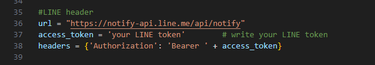
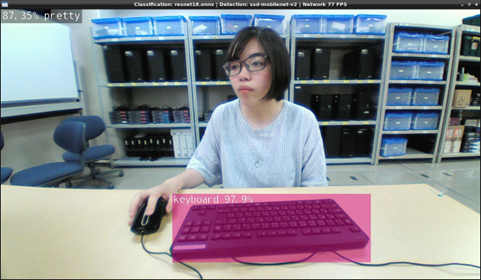
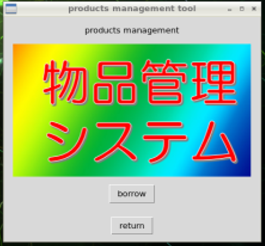
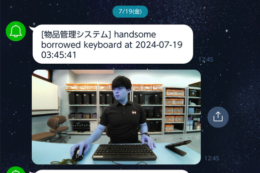

# 物品管理システム
## 説明
これはJetson NanoとWebカメラを使用して物品を管理するアプリケーションです。Webカメラに映る人と物体を同時に認識します。その状態でボタン（borrow/return）を押すといつだれが何をどうしたのかという情報がCSVとラインに送られます。カメラに映る人は画像のクラス分類によって識別します。カメラに映る物体は物体検出を行うことで認識することができます。

## 背景
職場にはPCやキーボード，コード類など様々な物品が存在します．それらの物品を正しく管理しなければなりませんが，時間と手間がかかります．そのため，物品管理を自動的に行うことができるシステムがあると便利だとと考えました．そこで考えたものが，Webカメラから人と物品を同時に認識し，その情報をJetson上で管理するというシステムです．

## デモ
具体的な動作については以下のURLからデモ動画をご覧ください。
https://drive.google.com/file/d/1nlDC7s7iDI67seOBCiGJYuB6_nZgzsO1/view?usp=sharing

## 使い方
### 使用機材
- Jetson Nano
- webカメラ

### インストール
Jetsonのローカル上で以下のコマンドを実行することで、プログラムをcloneする。
```
git clone –recursive git@github.com:ayakasakurai0213/jetson-inference.git
```

以下のコマンドを実行してdockerコンテナを起動する。
```
cd jetson-inference
./docker/run.sh
```

dockerコンテナ内のターミナルで以下のコマンドを実行する。物品管理システムのプログラムを実行するために必要なライブラリをインストールする。
```
apt-get update
apt-get install python3-tk
```

### LINEトークン発行
37行目のaccess_tokenにLINEトークンを書き込んで保存
```
cd /jetson-inference/python/examples/goods-management/
vi image_detect_net.py
```


### 実行
dockerコンテナ内のターミナルで以下のコマンドを実行する。すると、以下の画像に示すような虹色のGUIとカメラ画像が表示され、物品管理システムが起動する。
```
cd /jetson-inference/python/examples/goods-management/
python3 image_detect_net.py /dev/video0
```


### 操作方法
1. カメラ画面の下半分に机が写るような位置にwebカメラを設置する。

2. 机の上に物品を置き、物品と自分の顔がカメラで認識できるように写す。

3. 左上のラベルが正しいこと、物品が検出されていることを確認する。<br>


4. borrow/returnをクリックする<br>


5. LINEにカメラ画像とメッセージが送られる<br>



