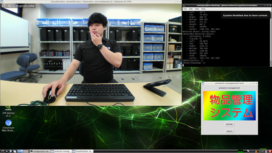

# Goods Management System
## Features
これはJetson NanoとWebカメラを使用して物品を管理するアプリケーションです。Webカメラに映る人と物体を同時に認識します。その状態でボタン（borrow/return）を押すといつだれが何をどうしたのかという情報がCSVとラインに送られます。カメラに映る人は画像のクラス分類によって識別します。カメラに映る物体は物体検出を行うことで認識することができます。

## Story
職場にはPCやキーボード，コード類など様々な物品が存在します．それらの物品を正しく管理しなければなりませんが，時間と手間がかかります．そのため，物品管理を自動的に行うことができるシステムがあると便利だとと考えました．そこで考えたものが，Webカメラから人と物品を同時に認識し，その情報をJetson上で管理するというシステムです．

## Demo
If you want to know more about the specific operation, please watch the demonstration video at the following URL: <br>
https://drive.google.com/file/d/1nlDC7s7iDI67seOBCiGJYuB6_nZgzsO1/view?usp=sharing

## How To Use
### Equipment
- Jetson Nano
- web cam

### Installation
Clone the program by entering the following command in local environment of Jetson.
```
git clone –recursive git@github.com:ayakasakurai0213/jetson-inference.git
```

Run the docker container by entering the following command.
```
cd jetson-inference
./docker/run.sh
```

Install tkinter to run the program of the goods management system. Enter the following command on the terminal in the docker container.
```
apt-get update
apt-get install python3-tk
```

### Issuance of a LINE token
Login LINE Notify and issue the access token. <br>
LINE Notify: https://notify-bot.line.me/ja/

Fill in the access token on line 37 of the program and save it.
```
cd /jetson-inference/python/examples/goods-management/
vi image_detect_net.py
```


### Program running

Enter the following command on the terminal in the docker container. Then the rainbow colored GUI and camera view will be displayed and the goods management system is activated.

```
cd /jetson-inference/python/examples/goods-management/
python3 image_detect_net.py /dev/video0
```


### Operation
> 1. カメラ画面の下半分に机が写るような位置にwebカメラを設置する。
> 2. 机の上に物品を置き、物品と自分の顔がカメラで認識できるように写す。
> 3. 左上のラベルが正しいこと、物品が検出されていることを確認する。
> 4. borrow/returnをクリックする。
> 5. LINEにカメラ画像とメッセージが送られる


## Author
- ayakasakurai0213
- 
