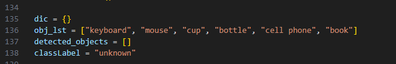

# Tools Management System
## Features
This is tools management system using Jetson Nano and the webcam. It recognizes a person and tools on the webcam simultaneously. If you click on the button in that state, information about "who did what" and "when" is sent to CSV and LINE. The person in webcam is identified by image classification.　Tools in webcam is recognized by image object detection.

## Story
There are many kinds of tools in a workspace. For example PC, keyboard and cables. We have to manage them but it takes a lot of time and effort. So, we thought it would be useful to create a system that automatically manages tools.

## Demo
If you want to know more about the specific operation, please watch the demonstration video at the following URL: <br>
https://drive.google.com/file/d/1nlDC7s7iDI67seOBCiGJYuB6_nZgzsO1/view?usp=sharing

## How To Use
### Equipment
- Jetson Nano
- webcam

### Installation
Clone the program by entering the following command in local environment of Jetson.
```
git clone –recursive git@github.com:ayakasakurai0213/jetson-inference.git
```

Run the docker container by entering the following command.
```
cd jetson-inference
./docker/run.sh
```

Install tkinter to run the program of the tools management system. Enter the following command on the terminal in the docker container.
```
apt-get update
apt-get install python3-tk
```

### Issuance of a LINE token
Login LINE Notify and issue the access token. <br>
LINE Notify: https://notify-bot.line.me/ja/

Fill in the access token on line 37 of the program and save it.
```
cd /jetson-inference/python/examples/tools-management/
vi image_detect_net.py
```


### Program running

Enter the following command on the terminal in the docker container. Then the rainbow colored GUI and camera view will be displayed and the tools management system is activated.

```
cd /jetson-inference/python/examples/tools-management/
python3 image_detect_net.py /dev/video0
```


### Operation
> 1. Place the webcam so that the desk appears in the lower half of the camera screen.
> 2. Put tools on the desk and appear the tools and your face in the camera screen so that webcam can be recognized them.
> 3. Check the label in the upper left corner is correct and the tools are detected.
> 4. Click on "borrow" or "return".
> 5. Camera veiw and messages are sent to your LINE.


## Author
- ayakasakurai0213
- 
